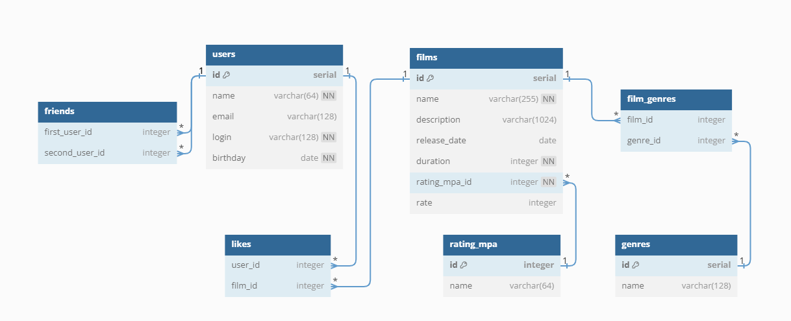

# Filmorate
## Простая соцсеть для любителей фильмов
* Приложение написано на Spring Boot с подключением к БД Postgres при помощи JDBC и класса JdbcTemplate
* Основные CRUD-операции с фильмами и пользователями, а также возможность: добавлять/удалять лайк фильму + получать наиболее залайканный, добавлять/удалять друзей + получать общих друзей с конкретным пользователем
* Запросы и маппинг сущностей осуществляется вручную + решена проблема N+1 запросов. Схема БД прилагается

